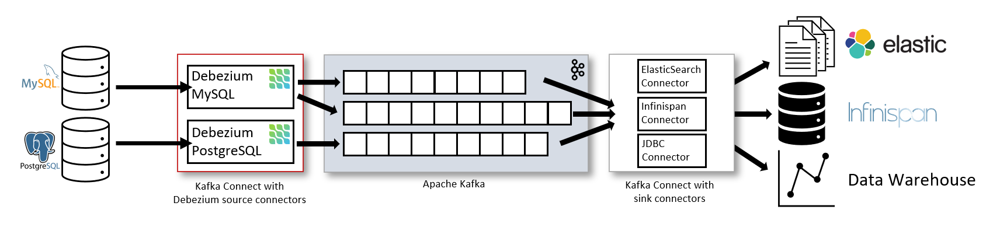
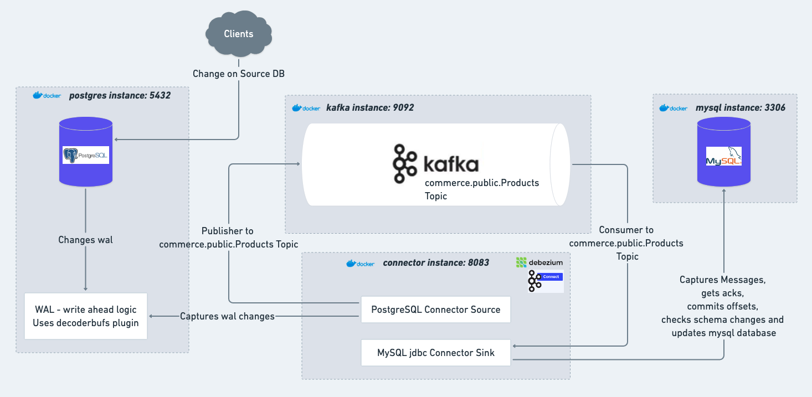
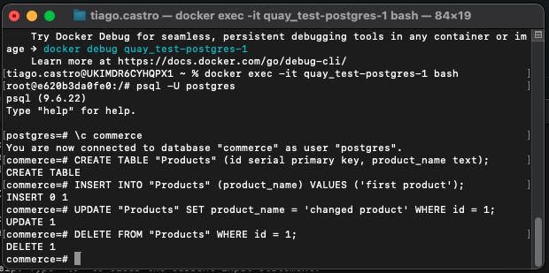
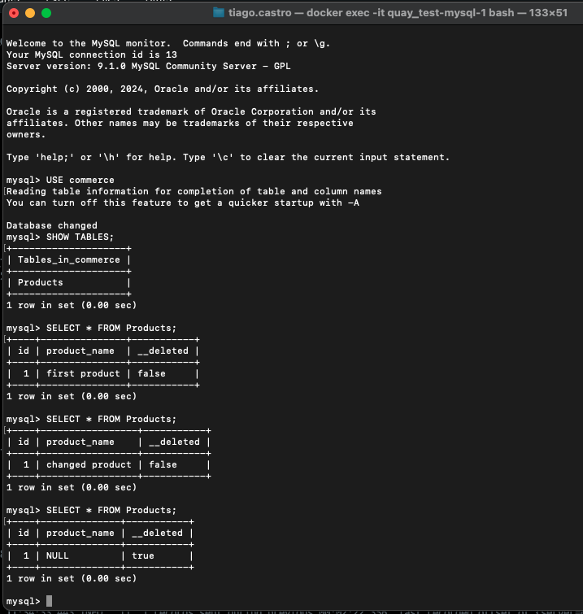

# Summary

With this setup, I achieve CDC between a PostgreSQL instance and a MySQL database. With this approach I can do CQRS without explicit need to write Kafka Producer and Consumer to capture command service database changes and then have a BackgroundService running every x seconds on the query service to consume incoming changes and handle them (separate logic has to be written to handle INSERT, UPDATE and DELETE). This works the same way as the debezium/server. It's just a more documentation aligned solution.

## Idea behind this project: (image taken from Debezium Website)



## Architecture in this application:



## The different between using debezium/server image and debezium/connector image:

The difference is that I need to bring the debezium connector container up and configure it with a post request to http://localhost:8083/connectors.

## Configuration of the Connector Source:

Make post request to http://localhost:8083/connectors with the body:

```json
{
  "name": "pg-source-connector",
  "config": {
    "connector.class": "io.debezium.connector.postgresql.PostgresConnector",
    "database.hostname": "postgres",
    "database.port": "5555",
    "database.user": "postgres",
    "database.password": "postgres",
    "database.dbname": "commerce",
    "topic.prefix": "commerce",
    "table.include.list": "public.Products"
  }
}
```

## PostgreSQL specific detail for Connector Source:

Also we will need to add to the psql db the `decoderbufs` plugin alongside with the `wal`configuration, or use image debezium/postgres:latest instead.

See:
https://github.com/debezium/postgres-decoderbufs/blob/main/README.md
https://debezium.io/documentation/reference/stable/connectors/postgresql.html#installing-postgresql-output-plugin

## PostgreSQL docker-compose service:

```yaml
postgres:
  image: debezium/postgres:latest
  environment:
    - POSTGRES_USER=postgres
    - POSTGRES_PASSWORD=postgres
    - POSTGRES_DB=commerce
  ports:
    - "5432:5432"
  command: ["postgres", "-c", "wal_level=logical"]
```

## MySQL docker-compose service:

```yaml
mysql:
  image: mysql
  environment:
    - MYSQL_ROOT_PASSWORD=mysql
    - MYSQL_USER=mysql
    - MYSQL_PASSWORD=mysql
    - MYSQL_DATABASE=commerce
  ports:
    - "3306:3306"
```

## Kafka + Zookeeper docker-compose services:

```yaml
zookeeper:
    image: confluentinc/cp-zookeeper
    container_name: zookeeper
    environment:
      ZOOKEEPER_CLIENT_PORT: 2181
      ZOOKEEPER_TICK_TIME: 2000
    ports:
      - '2181:2181'

  kafka:
   image: confluentinc/cp-kafka
   container_name: kafka
   depends_on:
      - zookeeper
   environment:
      KAFKA_ZOOKEEPER_CONNECT: zookeeper:2181
      KAFKA_ADVERTISED_LISTENERS: PLAINTEXT://kafka:9092
      KAFKA_OFFSETS_TOPIC_REPLICATION_FACTOR: 1
```

## Debezium Kafka Connect docker-compose service:

```yaml
connector:
  image: quay.io/debezium/connect
  ports:
    - "8083:8083"
  environment:
    GROUP_ID: 1
    CONFIG_STORAGE_TOPIC: _connect_configs
    OFFSET_STORAGE_TOPIC: _connect_offsets
    STATUS_STORAGE_TOPIC: _connect_status
    BOOTSTRAP_SERVERS: kafka:9092
    CONNECT_CONFIG_STORAGE_REPLICATION_FACTOR: 1
    CONNECT_OFFSET_STORAGE_REPLICATION_FACTOR: 1
    CONNECT_STATUS_STORAGE_REPLICATION_FACTOR: 1
  depends_on:
    - zookeeper
    - kafka
```

## jdbc Sink Configuration with MySQL database:

For the Sink POST body:

```json
{
  "name": "mysql-sink-connector",
  "config": {
    "connector.class": "io.debezium.connector.jdbc.JdbcSinkConnector",
    "tasks.max": "1",
    "connection.url": "jdbc:mysql://mysql:5306/commerce",
    "connection.username": "mysql",
    "connection.password": "mysql",
    "insert.mode": "upsert",
    "delete.enabled": "false",
    "primary.key.mode": "record_value",
    "primary.key.fields": "id",
    "schema.evolution": "basic",
    "database.time_zone": "UTC",
    "topics": "commerce.public.Products",
    "value.converter": "org.apache.kafka.connect.json.JsonConverter",
    "value.converter.schemas.enable": "true",
    "key.converter": "org.apache.kafka.connect.json.JsonConverter",
    "key.converter.schemas.enable": "false",
    "table.name.format": "Products",
    "transforms": "unwrap",
    "transforms.unwrap.type": "io.debezium.transforms.ExtractNewRecordState",
    "transforms.unwrap.drop.tombstones": "true",
    "transforms.unwrap.delete.handling.mode": "rewrite"
  }
}
```

## Testing and Debugging the docker containers:

1. To use psql in the terminal so we can watch the logs in the connector image:

```bash
docker exec -it quay_test-postgres-1 bash
psql -U postgres
\c commerce
CREATE TABLE "Products" (id serial primary key, product_name text);
INSERT INTO "Products" (product_name) VALUES ('first product');
UPDATE "Products" SET product_name = 'changed product' WHERE id = 1;
DELETE FROM "Products" WHERE id = 1;
```

2. To use mysql in the terminal so we can watch the logs in the connector image:

```bash
docker exec -it quay_test-mysql-1 bash
mysql -U mysql -p
USE commerce;
CREATE TABLE Products (id INTEGER PRIMARY KEY, product_name VARCHAR(255)); # it will create automatically the table
SELECT * FROM Products;
SELECT * FROM commerce_public_Products; # if the table.name: ${topic}
```

3. When making changes to the PSQL db, will change the wal which Debezium will pick up to publish to the specified topic:

- 3.1. 

4. From MySQL side, it picks up the results are as expected:

- 4.1. 

5. Kafka commands to debug topics or check sent messages to the topic:

```bash
docker exec -it kafka bash
kafka-topics --bootstrap-server localhost:9092 --list
kafka-console-consumer --bootstrap-server localhost:9092 --topic commerce.public.Products --from-beginning
kafka-console-producer --bootstrap-server localhost:9092 --topic commerce.public.Products
```

## Debezium Kafka Connect REST endpoints:

1. GET: http://localhost:8083/connectors
2. POST (to configure connectors): http://localhost:8083/connectors
3. GET: http://localhost:8083/connectors/<your-connector-name>/status
4. GET (check connector classes available): http://localhost:8083/connector-plugins
5. DELETE: http://localhost:8083/connectors/<your-connector-name>
